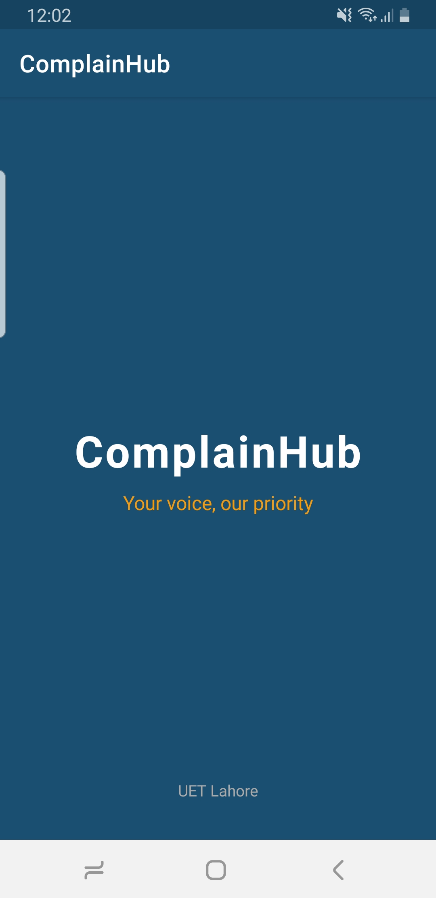
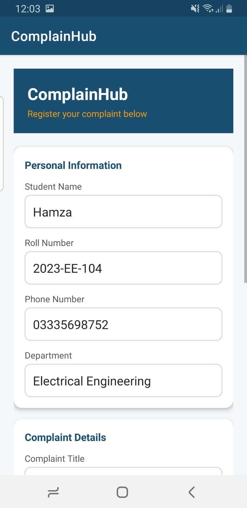
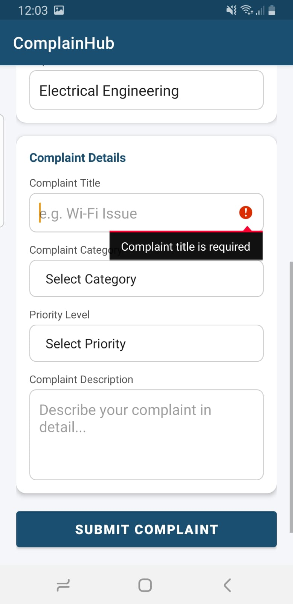
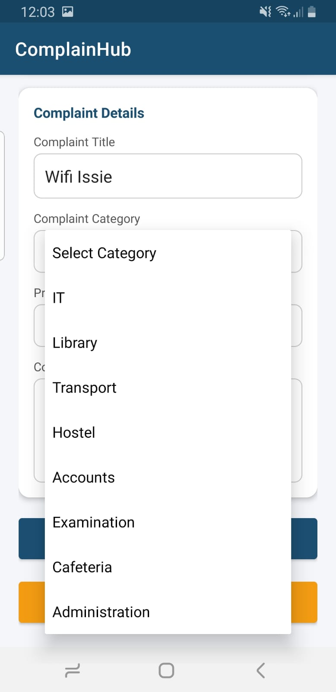
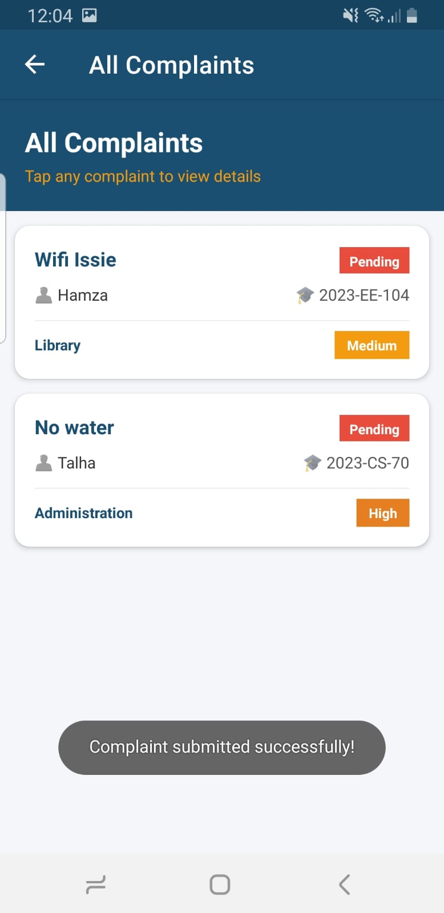
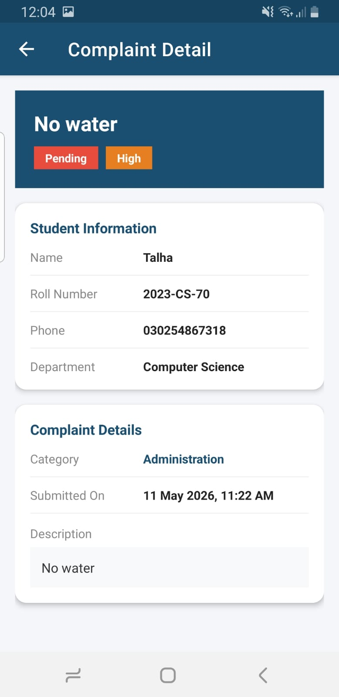

# ComplainHub 📋
 
A student complaint registration Android app built with **Kotlin** and **Firebase Realtime Database**. Students can submit complaints, choose a category and priority, and view all submitted complaints in real time — with color-coded badges and a clean detail screen.
 
---
 
## Screenshots
 
| | |
|:---:|:---:|
|  |  |
| **Splash Screen** | **Registration Form** |
|  |  |
| **Form Validation** | **Complaint List** |
|  |  |
| **Complaints** | **Complaint Details** |
 
 
---
 
## About
 
ComplainHub was built as a quiz project for the Mobile Application Development course at **UET Lahore**. The idea was to make a real working app where students can register complaints against university departments, pick a priority level, and have everything stored live in Firebase — no local database, no server.
 
The app has four screens, field-level validation on every input, color-coded priority and status badges, and a detail screen that shows the full complaint with a nicely formatted date and time.
 
---
 
## Features
 
- **Splash Screen** — shows the app name and tagline for 2.5 seconds, then navigates to the form automatically
- **Complaint Registration Form** — collects student name, roll number, phone number, department, complaint title, category (spinner), priority (spinner), and a detailed description
- **Smart Field Validation** — every field is checked before submission with specific error messages:
  - Name must be at least 3 characters and letters only
  - Roll number must follow a valid format like `BSCS-101` or `2023-CS-70`
  - Phone number must be a valid Pakistani mobile number starting with `03` and exactly 11 digits
  - Department must be at least 2 characters
  - Complaint title must be at least 5 characters
  - Category and priority spinners must not be left on the default placeholder
  - Description must be at least 20 characters
- **Firebase Save** — on successful validation, complaint is saved to Firebase Realtime Database with a unique key and live timestamp
- **Success Feedback** — toast message shown on successful submission, form clears automatically
- **Complaint List Screen** — fetches all complaints from Firebase and shows them in a RecyclerView sorted by newest first
- **Priority Badges** — color-coded pill badges: Urgent (red), High (orange), Medium (amber), Low (green)
- **Status Badges** — Pending (red), Resolved (green)
- **Empty State** — emoji + message shown when no complaints exist yet
- **Complaint Detail Screen** — full information display with formatted date (`11 May 2026, 11:30 AM`), category, priority, and status
- **Back Navigation** — ActionBar back button works correctly on all screens
---
 
## Tech Stack
 
| Tool | Version | Purpose |
|---|---|---|
| Kotlin | 2.0.21 | Primary language |
| Android Studio | Latest | IDE |
| Firebase Realtime Database | BOM 33.10.0 | Cloud data storage |
| RecyclerView | — | Complaint list display |
| CardView | — | Individual complaint cards |
| Material Components | 1.12.0 | UI components |
| ConstraintLayout | 2.2.0 | Splash layout |
 
---
 
## Project Structure
 
```
app/
├── src/main/
│   ├── java/com/example/quiz2/
│   │   ├── Complaint.kt                    data class with all fields + default status "Pending"
│   │   ├── FirebaseHelper.kt               singleton object for save and fetch operations
│   │   ├── SplashActivity.kt               2.5s splash then launches MainActivity
│   │   ├── MainActivity.kt                 registration form with full field validation
│   │   ├── ComplaintListActivity.kt        RecyclerView screen with live Firebase listener
│   │   ├── ComplaintAdapter.kt             adapter with priority and status color logic
│   │   └── ComplaintDetailActivity.kt      full detail view with formatted timestamp
│   ├── res/
│   │   ├── layout/
│   │   │   ├── activity_splash.xml
│   │   │   ├── activity_main.xml
│   │   │   ├── activity_complaint_list.xml
│   │   │   ├── item_complaint.xml
│   │   │   └── activity_complaint_detail.xml
│   │   ├── drawable/
│   │   │   ├── input_background.xml        white rounded border for EditText fields
│   │   │   └── badge_background.xml        rounded pill shape for priority/status badges
│   │   └── values/
│   │       ├── colors.xml
│   │       ├── strings.xml
│   │       └── themes.xml
│   └── AndroidManifest.xml                 INTERNET permission + all 4 activities declared
├── gradle/
│   └── libs.versions.toml                  centralized version catalog
├── build.gradle.kts (project)
├── build.gradle.kts (app)
├── google-services.json                    download from Firebase Console, place in app/
└── screenshots/                            add your screenshots here
```
 
---
 
## Validation Rules Reference
 
| Field | Rule |
|---|---|
| Student Name | Required · Min 3 chars · Letters and spaces only |
| Roll Number | Required · Alphanumeric with `-` or `/` allowed (e.g. `BSCS-101`) |
| Phone Number | Required · Must start with `03` · Exactly 11 digits |
| Department | Required · Min 2 characters |
| Complaint Title | Required · Min 5 characters |
| Category | Must not be left on "Select Category" |
| Priority | Must not be left on "Select Priority" |
| Description | Required · Min 20 characters |
 
---
 
## Complaint Categories
 
| Category | Covers |
|---|---|
| IT | Internet, computer lab, software, system issues |
| Library | Books, library cards, seating, services |
| Transport | Bus timings, routes, driver complaints |
| Hostel | Rooms, cleanliness, water, maintenance |
| Accounts | Fee, challan, payment, account issues |
| Examination | Roll number slips, marks, results, exam process |
| Cafeteria | Food quality, pricing, service |
| Administration | General administrative complaints |
 
---
 
## Priority Levels
 
| Priority | Color | Meaning |
|---|---|---|
| Low | 🟢 Green `#27AE60` | Not urgent, can wait |
| Medium | 🟡 Amber `#F39C12` | Needs normal attention |
| High | 🟠 Orange `#E67E22` | Should be handled quickly |
| Urgent | 🔴 Red `#E74C3C` | Requires immediate action |
 
---
 
## Color Scheme
 
| Color | Hex | Used For |
|---|---|---|
| Deep Navy | `#1B4F72` | Header bars, primary buttons, card titles |
| Amber Gold | `#F39C12` | Tagline, secondary button, medium priority |
| Light Grey | `#F4F6F9` | Screen backgrounds |
| White | `#FFFFFF` | Cards, input fields |
 
---
 
## Firebase Setup
 
1. Go to [Firebase Console](https://console.firebase.google.com/) and open your project
2. Navigate to **Realtime Database** — the URL used in this project is:
   ```
   https://quiz2app-680dc-default-rtdb.firebaseio.com
   ```
3. Go to the **Rules** tab and set this for development/testing:
   ```json
   {
     "rules": {
       ".read": true,
       ".write": true
     }
   }
   ```
4. Go to **Project Settings → Your Apps**, download `google-services.json` and place it inside the `app/` folder
> Never commit `google-services.json` to a public repo. Add it to `.gitignore`.
 
---
 
## How to Run
 
1. Clone or download this project
2. Open in **Android Studio**
3. Drop your `google-services.json` inside the `app/` directory
4. Let Gradle sync complete
5. Connect a device or start an emulator (min API 24)
6. Press **Run** or `Shift + F10`
7. Run "ComplainHub.apk" in root folder

**Requirements:**
 
| | |
|---|---|
| Minimum SDK | API 24 (Android 7.0) |
| Target SDK | API 35 |
| Kotlin | 2.0.21 |
| AGP | 8.7.3 |
 
---
 
## App Navigation Flow
 
```
Launch
  │
  ▼
Splash Screen  ── 2.5 seconds ──►  Registration Form (MainActivity)
                                            │
                           ┌────────────────┴────────────────┐
                           │                                  │
                 Validation fails                    All fields valid
                 Error shown on field                Saved to Firebase
                                                     Form clears
                                                     Toast shown
                                                           │
                                               Click "View All Complaints"
                                                           │
                                                           ▼
                                               Complaint List Screen
                                               (RecyclerView, newest first)
                                                           │
                                         ┌─────────────────┴─────────────────┐
                                         │                                    │
                                   No complaints                    Tap a complaint card
                                   Empty state shown                          │
                                                                              ▼
                                                                   Complaint Detail Screen
                                                                   (full info + date/time)
                                                                              │
                                                                   Press back button
                                                                              │
                                                                              ▼
                                                                   Returns to List
```
 
---
 
## Developer Notes
 
- `FirebaseHelper` uses `addValueEventListener` which keeps the list in sync live — if someone submits a complaint on another device, the list updates without refreshing
- Timestamps are stored as `Long` (milliseconds) and displayed as `dd MMM yyyy, hh:mm a` using `SimpleDateFormat`
- The phone validation regex `^03[0-9]{9}$` ensures exactly 11 digits starting with 03, covering all Pakistani networks (030x, 031x, 032x, 033x, 034x)
- Complaints are sorted by `timestamp` descending inside `FirebaseHelper.getAllComplaints()` before calling `onResult`
- Default complaint status is always `"Pending"` — set in the `Complaint` data class and explicitly passed on every submission
- `clearForm()` after submission also calls `editStudentName.requestFocus()` so cursor lands on the first field, ready for the next entry
---
 
## License
 
Built for academic purposes at UET Lahore — Mobile Application Development Quiz II. Free to use as reference.
Submitted By : 2023-CS-70 
Submitted To : Ma'am Rabeeya Saleem